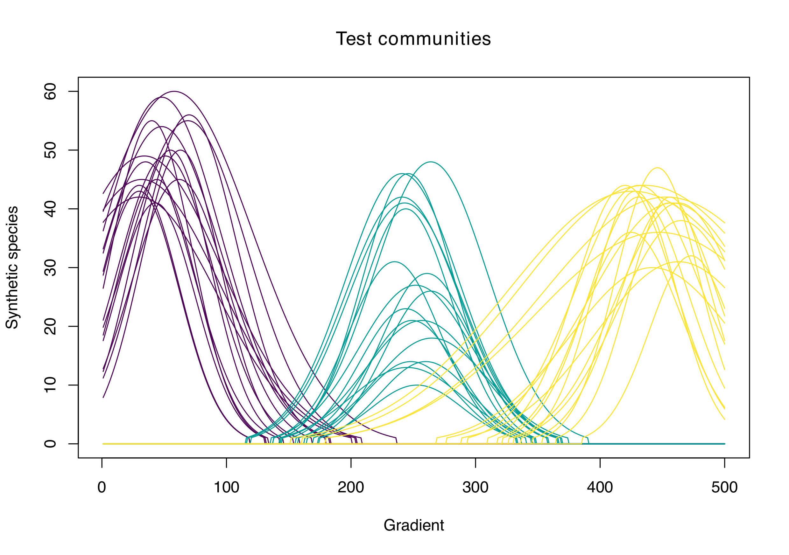
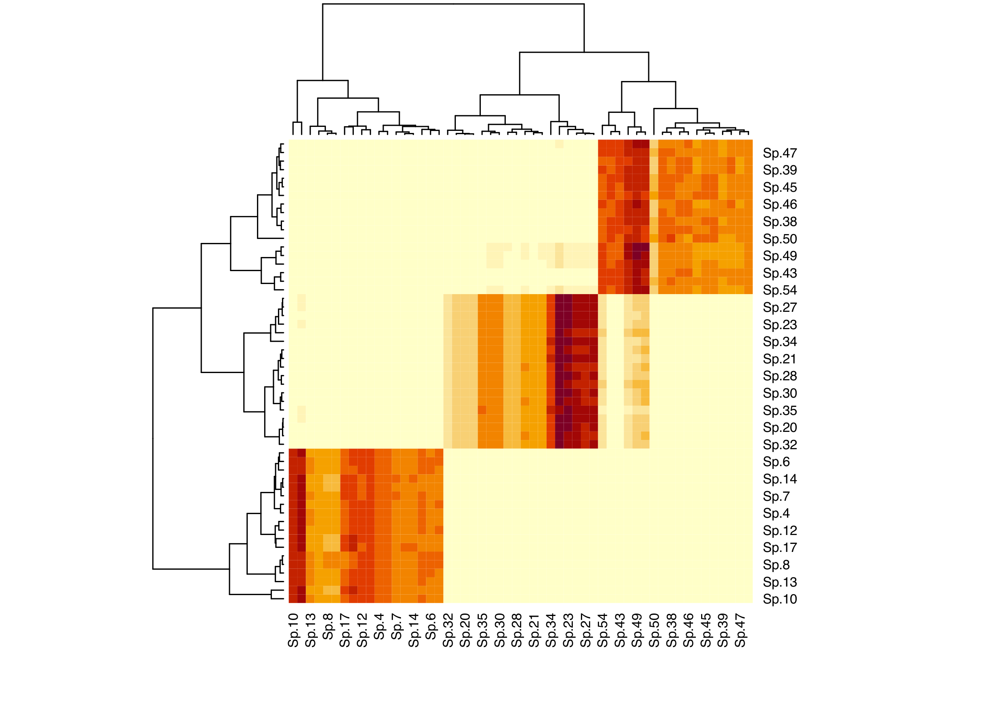
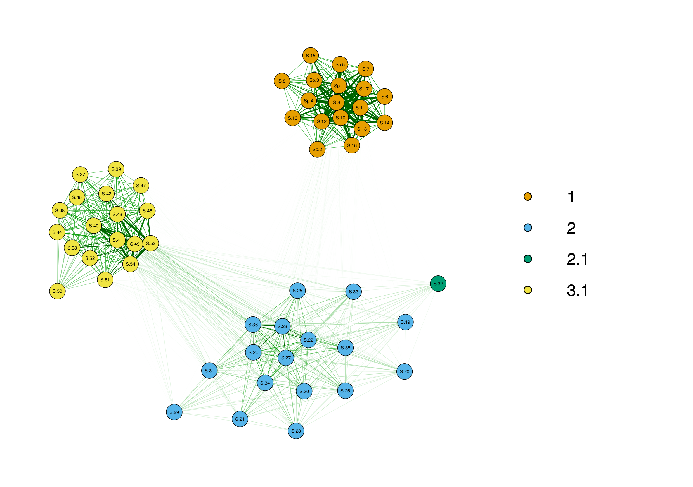
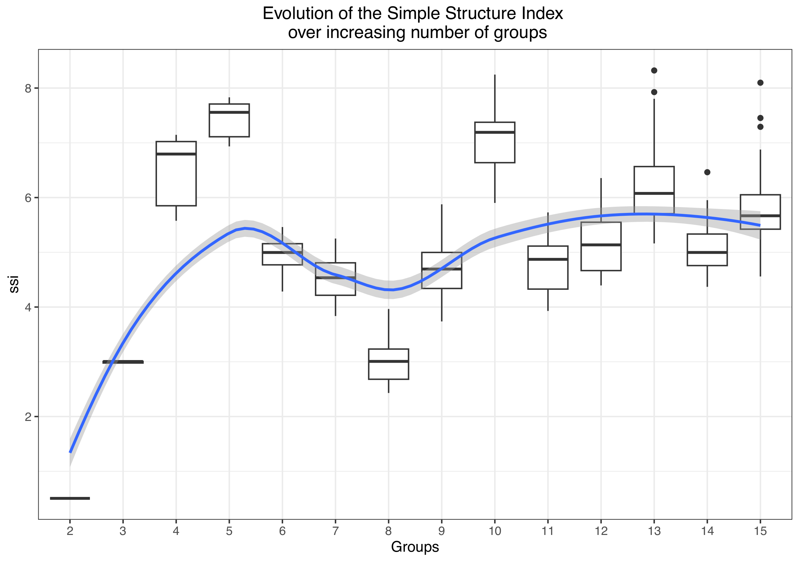
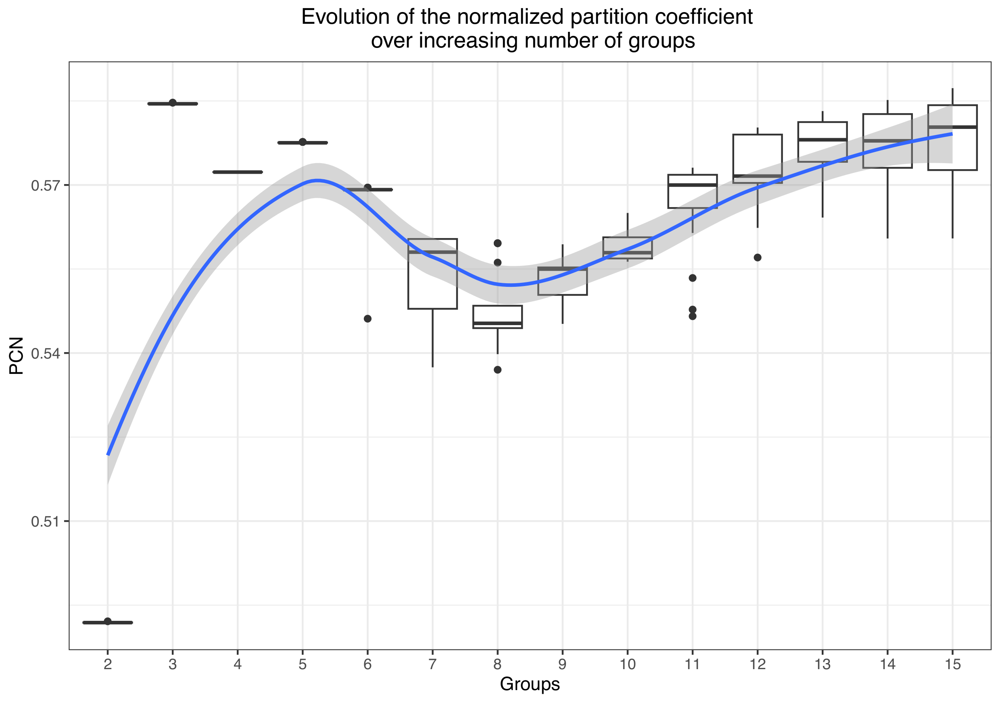

# Exploring data partitions for k-means and Fuzzy-c-means clustering:
One of the recurrent -- and vexing -- problems of ecology is the decision regarding the most adequate number of groups for clustering multivariate data. I already provided some functions (making use of heatmaps and networks) to facilitate this process in the `EcotoneFinder` package. \
Here I present another set of analyses that may be used to the same effect, using different partition indices and, particularly, their evolution when the data are subjected to segmentation by increasing number of groups. \
The initial idea for these functions came from a figure in a publication by Pav\~{a}o et.al, 2019 -- which I intended to reproduce for my own data -- and the extension of this protocol from k-means clustering to the fuzzy-c-means clustering I was using at the time.

## Provided functions:
Three functions are currently in the repository:
1. `cascadeFCM`: and extension of the `vegan::cascadeKM` for fuzzy-c-means clustering.
2. `KMeans_indices_test` to produce the data needed to draw a plot similar to the one in Pav\~{a}o et. al, 2019, with k-means clustering.
3. `FCM_indices_test` to produce the data needed to draw a plot similar to the one in Pav\~{a}o et. al, 2019, with fuzzy-c-means clustering.

All these functions might eventually be integrated in future versions of the `EcotoneFinder`package.

## Basic examples:
Considering the artificial data presented bellow, and provided in this repository:

The associated heatmap and networks (`qgraph`, running a spinglass algorithm to determine statistical communities in the network) both highlight three main groups, either as "squares" of more closely related species along the diagonal of the heatmap, or as groups of related nodes. This correctly describes the three main communities in the artificial data.\

Now -- running the `KMeans_indices_test` on the same data -- we obtain an optimum at $n = 5$ groups instead of $n = 3$. This may correspond to the ecotonal communities (i.e. three communities plus two ecotones).

The use of fuzzy indices (and thus, fuzzy clusters) -- using the `FCM_indices_test` -- now finds back the $n = 3$ optimum, although $n = 5$ still seems a reasonably good solution.

